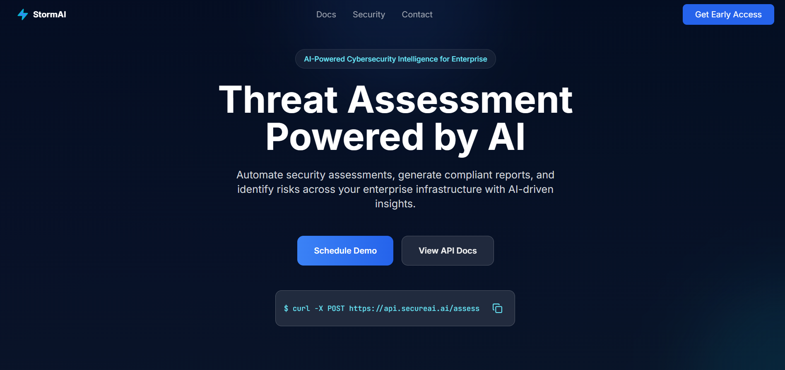

# StormAI Landing Page

Enterprise B2B SaaS cybersecurity AI platform landing page. StormAI provides advanced threat detection and vulnerability management powered by artificial intelligence.



## About

StormAI is a next-generation cybersecurity platform designed for enterprise organizations. Our AI-driven approach delivers:

- **Intelligent Threat Detection** – Machine learning models that identify advanced threats in real-time
- **Vulnerability Management** – Automated scanning and prioritization of security vulnerabilities
- **Compliance Automation** – Streamlined compliance reporting for regulatory frameworks
- **Incident Response** – Rapid threat response with AI-powered recommendations

## Getting Started

Install dependencies:

```bash
npm install
```

Run the development server:

```bash
npm run dev
```

Open [http://localhost:3000](http://localhost:3000) in your browser to view the landing page.

## Technology Stack

- **Framework**: [Next.js](https://nextjs.org) with App Router
- **Styling**: [Tailwind CSS](https://tailwindcss.com)
- **Language**: TypeScript
- **Deployment**: Optimized for Vercel

## Project Structure

- `app/` – Next.js application pages and layouts
- `components/` – Reusable React components
- `public/` – Static assets

## Development

The landing page automatically reloads as you edit files. Start with `app/page.tsx` to modify the main landing page content.

